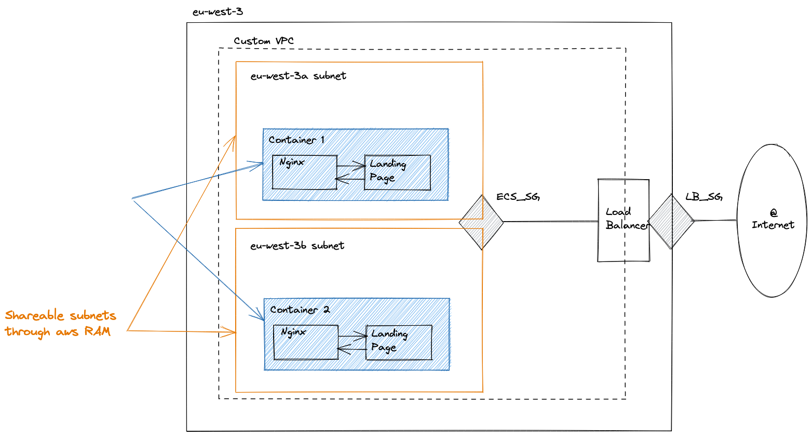

## Verkstedt Challenge
This repository maps out the deployment of a dockerized NGINX server on AWS using Terraform.
The final infrastructure of this server features

- A custom Virtual Private Cloud (VPC)
- Two shareable subnets with different availability zones
- An application load balancer

The full architecture is detailed below:

